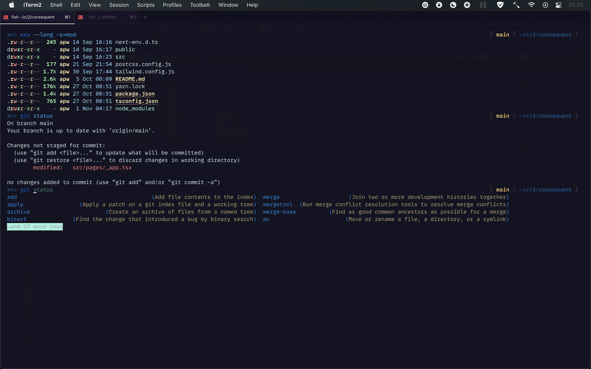

# A Collection of my dotfiles (2019)

## Shell Preview (2021)

## Info

This is a collection of configurations for both macOS, ubuntu, and some programs I use.

It is _not_ self-installing at the moment. I intend to add that in future.

I also need to add logic to differentiate between macOS/ubuntu and handle the differences as needed.

This is setup is currently not portable, and not designed for others to use as a drop in configuration. Feel free to peruse/borrow/copy things as you see fit, but there may be problems, and my documentation is scant at the moment.

## Contents

### OS

- macOS (10.14) default settings (`./macos/setup-defaults.sh`)

### Program Configs

- glances
- fish
- nvim
- iterm
- bat
- tmux
- vscode
- ssh (encrypted with ansible-vault)

### Related

My hammerspoon config is kept in a separate repo, but if you use macOS, you may find it interesting: <https://github.com/nonissue/hammerspoon>

### Links

- https://github.com/ibraheemdev/modern-unix

## Contact:

Feel free to open pull requests as you see fit. You can also contact me at andy@<githubusername>.org
